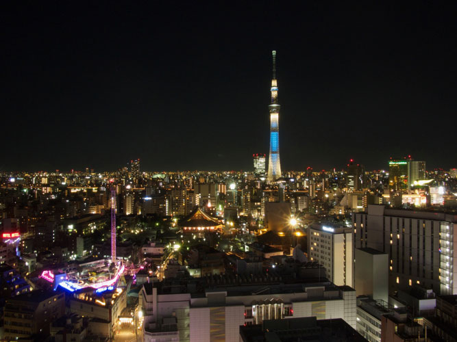

# Hexagonal Bokeh Blur Filter

This is an implementation note for the "[Hexagonal Bokeh Blur Filter](https://github.com/MetalPetal/MetalPetal/blob/master/Frameworks/MetalPetal/Filters/MTIHexagonalBokehBlurFilter.h)" in [MetalPetal](https://github.com/MetalPetal/MetalPetal).

## Previews

| Input | Mask | Output |
| ------------- | ------------- | ------------- |
|  |   |  |
|  |  |  |

## Implementation

### Files

[MTIHexagonalBokehBlurFilter.h](https://github.com/MetalPetal/MetalPetal/blob/master/Frameworks/MetalPetal/Filters/MTIHexagonalBokehBlurFilter.h)

[MTIHexagonalBokehBlurFilter.m](https://github.com/MetalPetal/MetalPetal/blob/master/Frameworks/MetalPetal/Filters/MTIHexagonalBokehBlurFilter.m)

[LensBlur.metal](https://github.com/MetalPetal/MetalPetal/blob/master/Frameworks/MetalPetal/Shaders/LensBlur.metal)

### Overview

The implementation is based on the concept described in **WHITE, John, and BARRÉ-BRISEBOIS, Colin. More Performance! Five Rendering Ideas From Battlefield 3 and Need For Speed: The Run, Advances in Real-Time Rendering in Games, SIGGRAPH 2011. [[Slides](https://www.slideshare.net/DICEStudio/five-rendering-ideas-from-battlefield-3-need-for-speed-the-run)]**, as well as the excellent blog post of Colin Barré-Brisebois [
Hexagonal Bokeh Blur Revisited](https://colinbarrebrisebois.com/2017/04/18/hexagonal-bokeh-blur-revisited/).

The implementation primarily follows the improved 2-pass version described in [
Hexagonal Bokeh Blur Revisited](https://colinbarrebrisebois.com/2017/04/18/hexagonal-bokeh-blur-revisited/) with the following modifications.

### Mask and CoC (Circle of Confusion)

The per pixel circle of confusion (CoC) should be calculated from real world camera parameters (focal length, aperture, focal plane, etc). Since we are building an image processing framework, and we do not have the full information of the camera or the depth map of the image, we leave this part to the framework users.

You need to provide an image as the source of per pixel CoC (the `inputMask` parameter). This mask image along with the `radius` parameter determine the per pixel blur amount.

The mask image can be generated in many ways from many sources depending on your application and needs:

- Using an image semantic segmentation neual network to create a foreground/background segementation mask.

- Using the depth map from the dual camera system or the TrueDepth camera to generate a mask. [WWDC 17 - Session 508](https://developer.apple.com/videos/play/wwdc2017/508/) / [WWDC 17 - Session 507](https://developer.apple.com/videos/play/wwdc2017/507/)

- Using the portrait segmentation API of iOS 12. [WWDC 18 - Session 503](https://developer.apple.com/videos/play/wwdc2018/503/)

- Don't provide a mask, make the full image blur.

- Let the user draw a mask.

### HDR and Lightness 

`MTIHexagonalBokehBlurFilter` uses a `pow(n)` and `pow(1/n)` approach to simulate highlights. The input texture is first powered with the `lightness_factor` to make the lighter colors pop out. After the blur effect is applied, the texture is powered with the `1.0/lightness_factor` to restore the color of the image. (Inspired by [@evanw](https://github.com/evanw)  https://github.com/evanw/glfx.js/blob/master/src/filters/blur/lensblur.js#L18)

We also did a little tweak to the original pixel shader to make the overall lightness of the output image to be consistent with the input image.

The original second pass pixel shader:

```
// Get the center to determine the radius of the blur
float coc = tex2D(verticalBlurTexture, uv).a;
float coc2 = tex2D(diagonalBlurTexture, uv).a;

// Sample the vertical blur (1st MRT) texture with this new blur direction
float2 blurDir = coc * invViewDims * float2(cos(-PI/6), sin(-PI/6));
float4 color = BlurTexture(verticalBlurTexture, uv, blurDir) * coc;

// Sample the diagonal blur (2nd MRT) texture with this new blur direction
float2 blurDir2 = coc2 * invViewDims * float2(cos(-5*PI/6), sin(-5*PI/6));
float4 color2 = BlurTexture(diagonalBlurTexture, uv, blurDir2) * coc2;

float3 output = (color.rgb + color2.rgb) * 0.5f;
```

Ours:

```
...
float coc = verticalTexture.sample(verticalSampler, vertexIn.textureCoordinate).a;
float coc2 = diagonalTexture.sample(diagonalSampler, vertexIn.textureCoordinate).a;
float4 color = (sampleWithDelta(verticalTexture, verticalSampler, vertexIn.textureCoordinate, delta0 * coc) +
                sampleWithDelta(diagonalTexture, diagonalSampler, vertexIn.textureCoordinate, delta1 * coc2))
                * (1.0/3.0);
...

```

Notice the final `* (1.0/3.0)` vs `* 0.5`.

The `verticalTexture` contains one color sample, while, the `diagonalTexture` contains two color samples:
```
// Output to MRT
PSOUTPUT output;
output.vertical = float4(color.rgb, coc);
output.diagonal = float4(color2.rgb + output.vertical.xyz, coc);
```
It is reasonable to `* (1.0 / 3.0)` in the end to maintain the lightness consistance.

### Multiple Render Targets in MetalPetal

MRT(Multiple Render Targets) is a feature of modern GPUs that allows the programmable rendering pipeline to render images to multiple render target textures at once. The 2-passs version of the filter requires MRT.

It is quite simple to do MRT with [MetalPetal](https://github.com/MetalPetal/MetalPetal).

- Create a render pipeline with the `colorAttachmentCount` set to the number of render targets you'd like to use.

  ```
  // MTIHexagonalBokehBlurFilter.m
  
  kernel = [[MTIRenderPipelineKernel alloc] initWithVertexFunctionDescriptor:[[MTIFunctionDescriptor alloc] initWithName:MTIFilterPassthroughVertexFunctionName]
                                                  fragmentFunctionDescriptor:[[MTIFunctionDescriptor alloc] initWithName:@"hexagonalBokehBlurAlpha"]
                                                            vertexDescriptor:nil
                                                        colorAttachmentCount:2
                                                       alphaTypeHandlingRule:MTIAlphaTypeHandlingRule.generalAlphaTypeHandlingRule];

  ```

- Mark the fragment shader output struct member with `color(n)` attributes.

  ```
  // LensBlur.metal
  
  typedef struct {
      float4 vertical [[color(0)]];
      float4 diagonal [[color(1)]];
  } HexagonalBokehBlurAlphaPassOutput;
  
  ```
  
- Get the output images.

  ```
  // MTIHexagonalBokehBlurFilter.m
  
  NSArray<MTIImage *> *outputs = [[MTIHexagonalBokehBlurFilter alphaPassKernel] applyToInputImages:@[...]
                                                                                        parameters:@{...}
                                                                                 outputDescriptors:@[firstOutputDescriptor,secondOutputDescriptor];
  ```

## Acknowledgements

Thanks to Jackie ([@fsjack](https://github.com/fsjack)) for the mask and coc releated optimzations.

Thanks to Martin ([@obs1dium](https://github.com/obs1dium)) for fixing the sample issue [#47](https://github.com/MetalPetal/MetalPetal/issues/47) and [pointing out the brightness problem](https://github.com/MetalPetal/MetalPetal/commit/3edb4c838d567410584aff22bc9067089a2ed2ea#comments).

[@evanw](https://github.com/evanw/) for his [JavaScript/WebGL implementation](https://github.com/evanw/glfx.js).

---

© 2019 Yu Ao

<a rel="license" href="http://creativecommons.org/licenses/by/4.0/"></a><br />This work is licensed under a <a rel="license" href="http://creativecommons.org/licenses/by/4.0/">Creative Commons Attribution 4.0 International License</a>.


